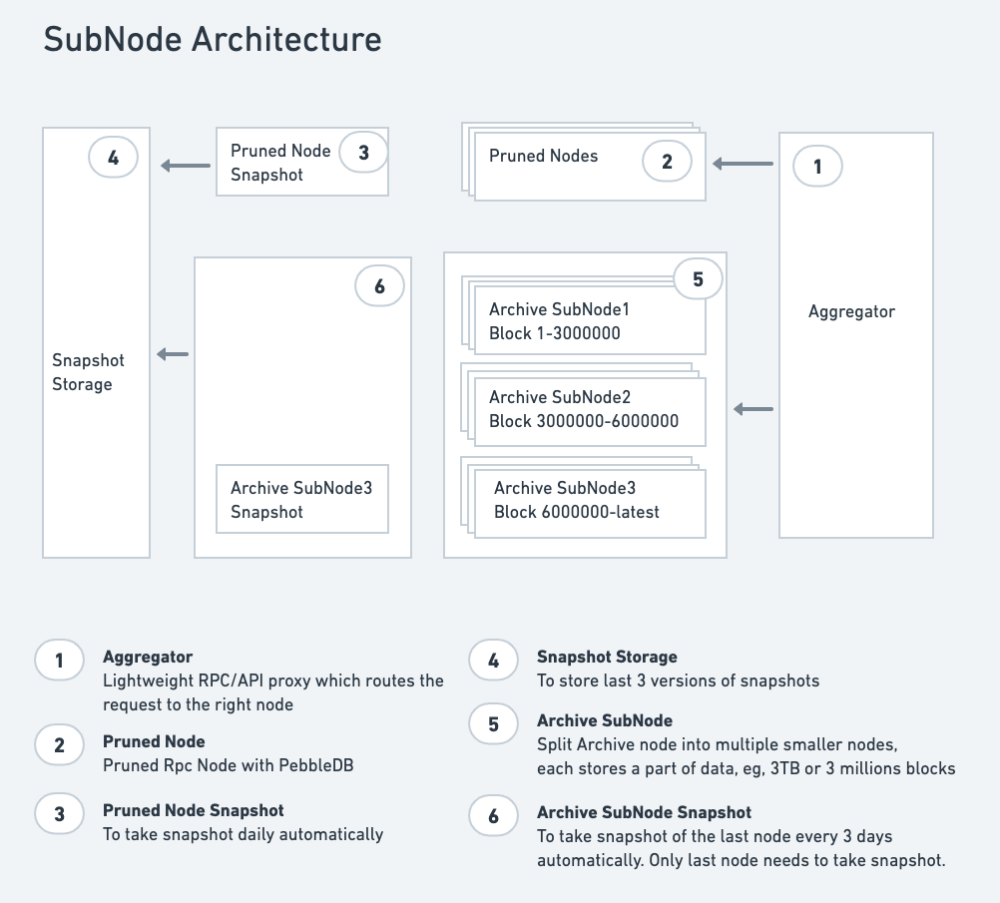

# subnode
aggregated proxy for sub-archive-nodes of tendermint/cosmos chains

Archive node data is big, major chains could grow 5TB/year and will stop working at some point.

This project is to make archive node could scale forever by breaking data into multiple smaller nodes (called sub-node).
Each subnode stores data of 5 millions blocks or 5 TB. Old subnodes are read-only.

As data is spreaded over multiple sub-nodes, its required to have a proxy which aggreates data from sub-nodes and provides compatible rpc/api.

